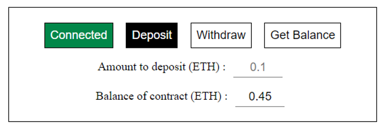

# Hardhat Fund Me

## Leaning smart contract whereby account users can fund and withdraw ETH 📊

### Here are some features of this smart contract:

- allows user to fund the smart contract with minimum amount of 50 USD
- allows user to fully withdraw their fund, leaving the smart contract with balance of zero
- ensures that only those who fund the smart contract can withdraw ETH

### Website Preview



### What I learnt:

- how to use ether.js and hardhat
- fetching latest ETH price in USD from chainlink price feed
- optimize gas cost by storing state variables from storage to memory
- include Goerli RPC Endpoints using Alchemy
- writing unit and staging test

### Quickstart

1. Clone the repo

```
git clone https://github.com/meikei-99/hardhat-fund-me.git

```

2. To execute a transaction, you will need to start a local hardhat blocchain

```
npx hardhat node / yarn hardhat node

```

3. Update constants.js with new contract address
4. Connect MetaMask to local hardhat blockchain (chainId:31337)

Credits go to @freeCodeCamp and @PatrickAlphaC who provide guidance in writing this piece.
